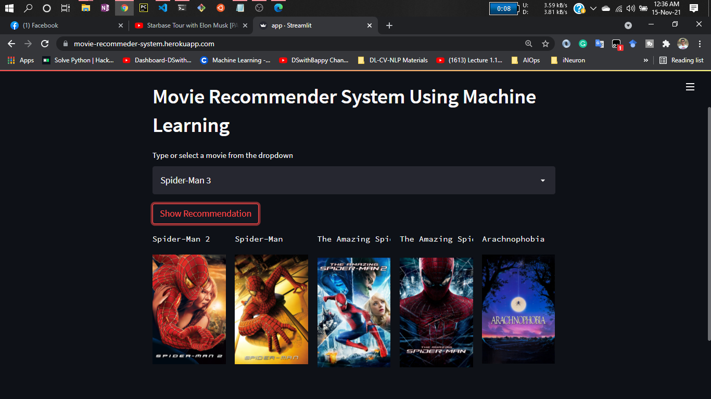

# Movie Recommender System

A content-based movie recommendation engine built with Python and Streamlit. This application suggests similar movies based on a user's selection, leveraging machine learning to analyze movie features.

[](https://movierecommmendersystem.streamlit.app/)

---

## 🎬 Live Demo

You can try the live application here:
**[https://movierecommmendersystem.streamlit.app/](https://movierecommmendersystem.streamlit.app/)**

---

## 📸 Application Preview


*(**Note**: You should replace the image link above with a high-quality screenshot or GIF of your own application.)*

---

## ✨ Features

* **Interactive UI:** A clean and simple user interface built with Streamlit.
* **Movie Selection:** Search and select from a dropdown list of 5,000 movies.
* **Instant Recommendations:** Get 5 movie recommendations instantly based on your choice.
* **Dynamic Posters:** Movie posters are fetched in real-time using the TMDB API.

---

## 🛠️ Tech Stack

* **Backend:** Python
* **Web Framework:** Streamlit
* **Data Manipulation:** Pandas, NumPy
* **Machine Learning:** Scikit-learn
* **API Interaction:** Requests
* **Deployment:** Streamlit Community Cloud

---

## ⚙️ How It Works

This project uses a **Content-Based Filtering** approach. The recommendation algorithm doesn't rely on user ratings but rather on the intrinsic properties of the movies themselves.

1.  **Data Collection:** The system uses the [TMDB 5000 Movie Dataset](https://www.kaggle.com/tmdb/tmdb-movie-metadata?select=tmdb_5000_movies.csv) from Kaggle.
2.  **Data Preprocessing:** Key features are extracted from the dataset for each movie, including **genres, keywords, cast, and crew (director)**.
3.  **Feature Engineering:** These text-based features are combined into a single text block, or "tag," for each movie. This creates a concise profile of the movie's content.
4.  **Vectorization:** The text tags are converted into numerical vectors using the **`CountVectorizer`** from Scikit-learn. Each movie is now represented as a vector in a high-dimensional space.
5.  **Similarity Calculation:** The **Cosine Similarity** metric is used to calculate the similarity between the vectors of every movie pair. A higher cosine similarity score means the movies are more alike in content.
6.  **Recommendation:** When a user selects a movie, the system finds its vector, retrieves its pre-computed similarity scores with all other movies, sorts them, and returns the top 5 most similar movies.

---

## 🚀 Getting Started

To run this project locally, follow these steps:

**1. Clone the repository:**
```bash
git clone [https://github.com/your-username/movierecommendersystem.git](https://github.com/your-username/movierecommendersystem.git)
cd movierecommendersystem
